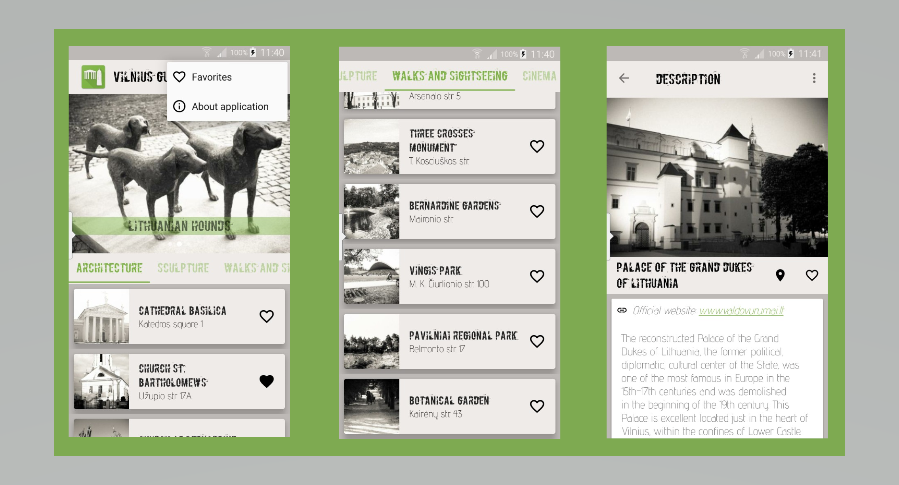

<h1 align="center">Vilnius Guide</h1>

<strong>5th Project of Google and Udacity Scholarship program 2017/2018: Android Basics Nanodegree.</strong>

Application created by Greta Grigutė.

<h2>About application</h2>

This application introduces users to VILNIUS - capital city of Lithuania. 

Application has:
- 6 lists of popular objects in Vilnius: 
1. Architecture
2. Sculpture
3. Walks and sightseeing
4. Cinema and theatre
5. Eat and drink
6. Shopping
- Unique design with b&w pictures, corresponding font.
- A changing view to show top 3 objects.
- Nice coordinator layout that hides top3 view when scrolling. 
- Posibility to make your own Favorites list.
- Menu with Favorites and About application pages.
- Each object in the lists has description page with: 
1. Description
2. Links for futher information/official pages
3. Google maps link
4. Button for sharing with friends
5. Clickable links/contacts (if provided).

<h2>Attribution</h2>

<b>Pictures authors:</b>
- Literatu Street, Cathedral Bell Tower, St. Annes Church, Gediminas av., Bernardine Church - Marius Grigutis
- Vingis Park, Bernardine Gardens and Grand Duke Gediminas Monument - Rūta Klimienė
- All other pictures - Greta Grigutė

<b>Application icon</b>: by Greta Grigutė

<b>Icons:</b> <a href="https://material.io/icons">material.io/icons</a>

<b>Main font</b>: <a href="http://flat-it.com/">Flat-it</a>

<b>Objects description source:</b> <a href="http://www.vilnius-tourism.lt">www.vilnius-tourism.lt</a>

<h2>Project main specifications/learnings</h2>

Application allowing to show information about chosen place as a tour guide, 
information provided in at least 4 lists with pictures and details.

Learnings:
- ViewPager plus TabLayout
- Fragments
- Custom object for storing information
- RecyclerView for showing lists
- Custom adapter to populate the layout
- Pictures stored as multiple density drawables
- Layout best practices
- Easily readable and understandable code, well formatted

Additional learnings:
- RecyclerView 
- Custom ripple effect on list item in RecyclerView
- Coordinator layout
- ViewPager in nested scrollView
- Data storage in Shared preferences
- Menu

<h2>Additional learning sources</h2>

- <b>Custom ripple effect solution:</b>
<a href="https://stackoverflow.com/questions/30931889/adding-ripple-effect-to-recyclerview-item/30933094#30933094">Ripple effect to RecyclerView item</a>
<a href="https://stackoverflow.com/a/28041873/5770629">Ripple effect on card view</a>
- <b>Coordinator layout learning sources:</b>
https://developer.android.com/reference/android/support/design/widget/CoordinatorLayout.html
http://saulmm.github.io/mastering-coordinator 
https://lab.getbase.com/introduction-to-coordinator-layout-on-android
- <b>Solution how to add view pager in nested scroll view:</b>
https://stackoverflow.com/questions/30580954/viewpager-in-a-nestedscrollview/33385207#33385207
- <b>Solution to data storage as shared preferences:</b>
https://developer.android.com/training/data-storage/shared-preferences.html#WriteSharedPreference
- <b>RecyclerView learning sources:</b>
http://www.vogella.com/tutorials/AndroidRecyclerView/article.html
https://www.androidhive.info/2016/01/android-working-with-recycler-view

<h2>Copyright</h2>

Copyright (c) 2018 Greta Grigutė

This project was submitted by Greta Grigutė, as part of Udacity's Android Basics Nanodegree (Google Developer Challenge 2017-2018).
This code is protected by <a href="https://www.udacity.com/legal/community-guidelines">Udacity Honor Code and Community Code of Conduct</a>.
Submitting this project as yours will cause you to break the Udacity Honor Code and Community Code of Conduct referenced above.
This project code was put to open-source for showcase what was learned, but author does not approve any form of plagiarism.
If author becomes aware of any case of someone copying this code (whole or part) and trying to submit as it's own project, author will notify the Udacity representatives.
